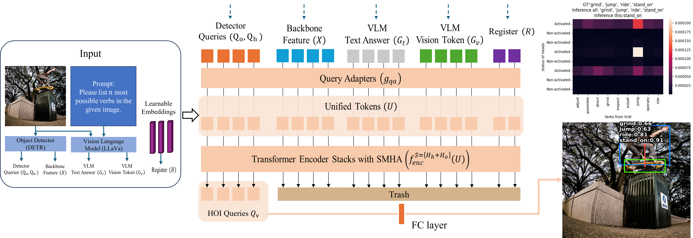
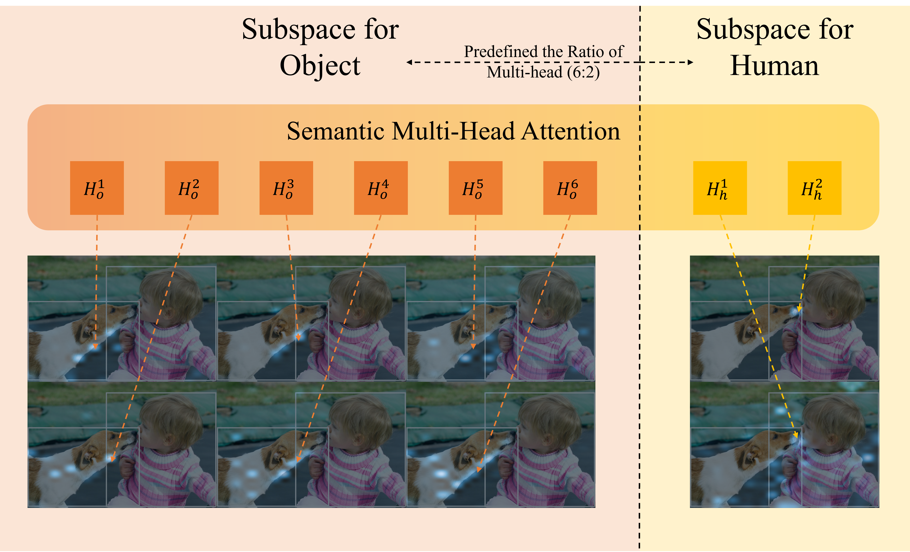
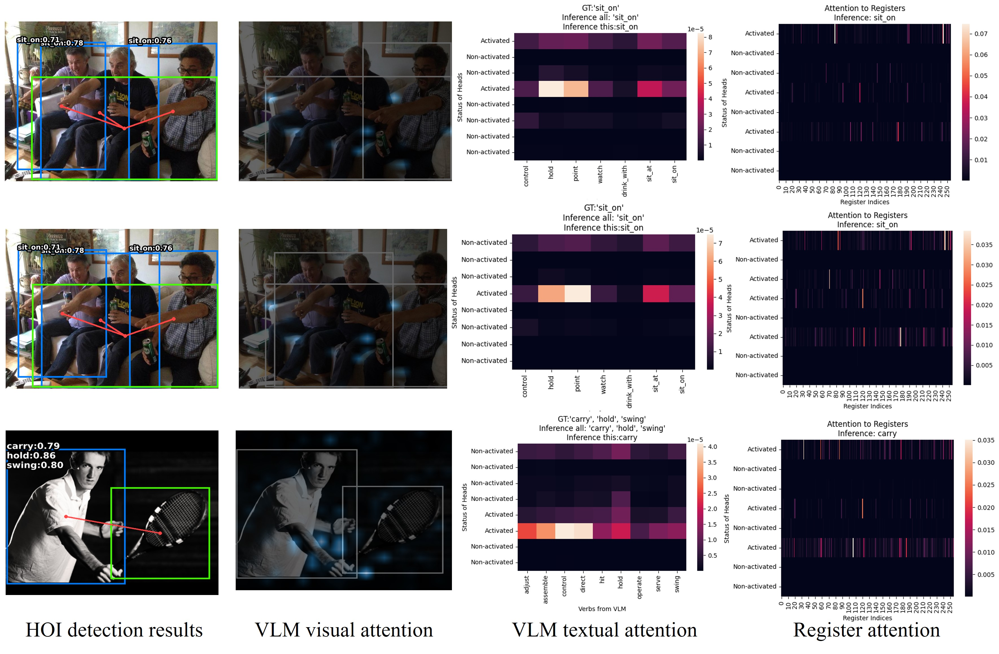

# UMI-HOI: Unifying Multimodal Information with Semantic Multi-Head Attention for Human-Object Interaction Detection

This repository is maintained by **Yuankai Wu** (Technical University of Munich) and contains the PyTorch implementation for the paper

> "UMI-HOI: Unifying Multimodal Information with Semantic Multi-Head Attention for Human-Object Interaction Detection", Yuankai Wu*, Zhinan Li*, Constantin Patsch, Marsil Zakour, Driton Salihu, Eckehard Steinbach; Proceedings of the IEEE/CVF Conference on Computer Vision and Pattern Recognition (CVPR), 2026, pp. 5999-6008 (\* equal contribution)

\[[__paper__](https://openaccess.thecvf.com/content/CVPR2026F/html/Wu_UMI-HOI_Unifying_Multimodal_Information_with_Semantic_Multi-Head_Attention_for_Human-Object_CVPRF_2026_paper.html)\]


&nbsp;&nbsp;

## Abstract
> Human-Object Interaction (HOI) detection has become a central task in computer vision, focusing on a deeper understanding of human activities. In previous work, most efforts focused on detecting HOI using isolated image information. With technological advancements, recent studies have increasingly explored large language models and text features. Although most of the existing approaches involve simple fusion of CLIP and image features, they lack granularity in framework exploration. To address this issue, we introduce a Unified architecture for Multimodal Information fusion (UMI-HOI), which jointly leverages visual embeddings and textual representations from the Vision Language Model (VLM) to enhance interaction reasoning. Unlike prior works where the learning process for HOI detection is largely unstructured, UMI-HOI explicitly defines the semantic roles of each attention head, yielding a novel Semantic Multi-head Attention Mechanism (S-MHA) that enables structured multi-modal representation learning. Our experimental results on two public benchmarks demonstrate that UMI-HOI not only achieves state-of-the-art performance in the supervised setting, but also shows remarkable generalization ability under zero-shot scenarios, highlighting the effectiveness of the proposed multi-modal fusion framework.

&nbsp;&nbsp;
## Prerequisites

1. Use the package management tool of your choice and run the following commands after creating your environment.
    ```bash
    # Clone the repo and submodules
    git clone https://github.com/ga94zot/UMI-HOI.git
    cd UMI-HOI
    git submodule init
    git submodule update
    # Say you are using Conda
    conda create --name umihoi python=3.8
    conda activate umihoi
    # Required dependencies
    pip install -r requirements.txt
    pip install -e pocket
    # Build CUDA operator for MultiScaleDeformableAttention
    cd h_detr/models/ops
    python setup.py build install
    ```
2. Prepare the [HICO-DET dataset](https://drive.google.com/open?id=1QZcJmGVlF9f4h-XLWe9Gkmnmj2z1gSnk).
    1. If you have not downloaded the dataset before, run the following script.
        ```bash
        cd /path/to/UMI-HOI/hicodet
        bash download.sh
        ```
    2. If you have previously downloaded the dataset, simply create a soft link.
        ```bash
        cd /path/to/UMI-HOI/hicodet
        ln -s /path/to/hicodet_20160224_det ./hico_20160224_det
        ```
3. Prepare the V-COCO dataset (contained in [MS COCO](https://cocodataset.org/#download)).
    1. If you have not downloaded the dataset before, run the following script
        ```bash
        cd /path/to/UMI-HOI/vcoco
        bash download.sh
        ```
    2. If you have previously downloaded the dataset, simply create a soft link
        ```bash
        cd /path/to/UMI-HOI/vcoco
        ln -s /path/to/coco ./mscoco2014
        ```
4. Prepare the LLaVA vision/text output (you can download the provided test features or generate them yourself):
    ```bash
    git clone https://github.com/ga94zot/llava.git
    cd llava
    ```

    ```Shell
    conda create -n llava python=3.10 -y
    conda activate llava
    pip install --upgrade pip  # enable PEP 660 support
    pip install -e .
    pip install cog
    ```

    ```bash
    python predict.py # for hico-det
    python predict_vcoco.py # for vcoco
    ```
5. Replace the CLIP feature from LLaVA with SigLIP 2 features (`google/siglip2-giant-opt-patch16-384`):
  Install a `transformers` version with SigLIP 2 support (>= 4.49) in a separate environment. Then modify the file in your installed package (see [siglip2/modified_forward.py](./siglip2/modified_forward.py)).

    ```bash
    python siglip2/generate_feature.py --images hicodet/hico_20160224_det/images/train2015 --out /path/to/hico_siglip_feature/train --device cuda:0
    python siglip2/generate_feature.py --images hicodet/hico_20160224_det/images/test2015  --out /path/to/hico_siglip_feature/test  --device cuda:0
    ```

    Alternatively, download the precomputed HICO-DET tokens (158 GB, bit-exact fp32) from the Hugging Face dataset [`Pikaqiu0114/hicodet-siglipv2-features`](https://huggingface.co/datasets/Pikaqiu0114/hicodet-siglipv2-features):

    ```bash
    python siglip2/hf_download_features.py --repo-id Pikaqiu0114/hicodet-siglipv2-features --out /path/to/hico_siglip_feature
    ```
## Visualization

Take an inference run and visualize a dataset. The visualized attention will be stored according to their properties in the folder `./visualization/...`

```bash
DETR=base python visualization.py --llava-answer-path llava_text_folder --llava-token-path llava_token_folder --batch-size 1 --index start_idx --action-score-thresh 0.2 --example-num num_of_images --avg-attn --repr-dim 512 --resume your_checkpoint
```


&nbsp;&nbsp;

## Training and Testing

Refer to the [documentation](docs.md) for model checkpoints and training/testing commands.


## License

UMI-HOI is released under the [BSD-3-Clause License](./LICENSE). The codebase builds
on the PViC implementation, whose original copyright notice is retained in
[LICENSE](./LICENSE) as required by that license.

## Citation

If you find this work useful for your research, please consider citing it:

```bibtex
@inproceedings{WuLi2026UMIHOI,
  author    = {Wu, Yuankai and Li, Zhinan and Patsch, Constantin and Zakour, Marsil and Salihu, Driton and Steinbach, Eckehard},
  title     = {{UMI-HOI}: Unifying Multimodal Information with Semantic Multi-Head Attention for Human-Object Interaction Detection},
  booktitle = {Proceedings of the IEEE/CVF Conference on Computer Vision and Pattern Recognition (CVPR)},
  year      = {2026},
  pages     = {5999--6008},
}
```
